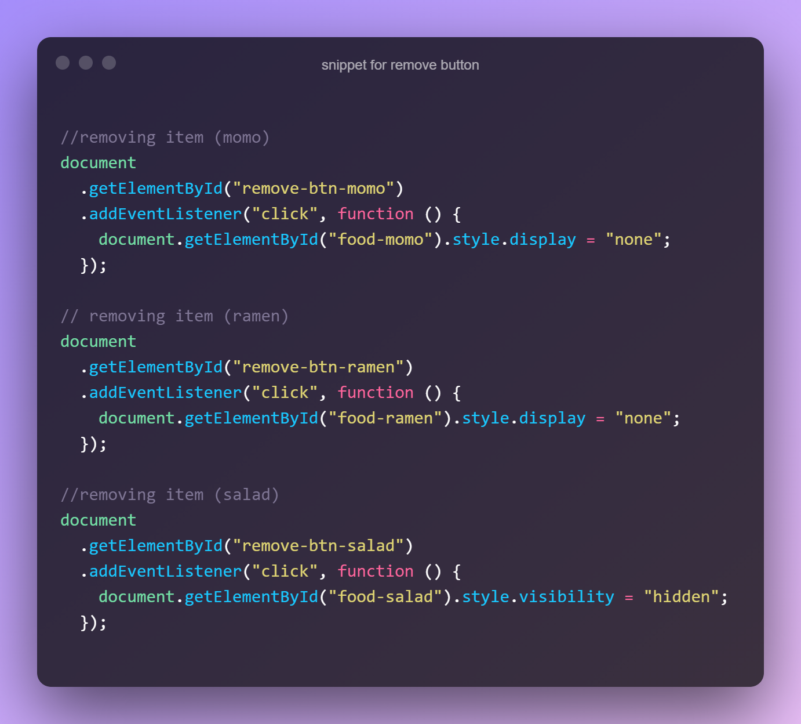

# Programming Hero - Shopping Cart Using JavaScript Solution

This is a solution to the [Shopping Cart Using Javascript and DOM Manipulation Challenge](https://github.com/ProgrammingHero1/shopping-cart). Programming Hero is a great frontend web development bootcamp for those who have the passion for learning and coding. It helps you improve your coding skills by buiding realistic projects.

## Table of contents

- [Overview](#overview)
  - [The challenge](#the-challenge)
  - [Screenshot](#screenshot)
  - [Links](#links)
- [My process](#my-process)
  - [Built with](#built-with)
  - [What I learned](#what-i-learned)
  - [Continued development](#continued-development)
  - [Useful resources](#useful-resources)
- [Author](#author)

## Overview

### The challenge

Users should be able to calculate the total item by increasing or decreasing the item quantity

### Screenshot

- Solution URL: [Git Repo](https://github.com/moeen-mahmud/shopping-cart-js)
- Live Site URL: [Live Site](https://shopping-cart-js-pi.vercel.app/)

## My Process

### Built With

- HTML5 markup
- [Tailwind CSS](https://tailwindcss.com/)
- JavaScript
- Document Object Model
- [Fontawesome](https://fontawesome.com/)

### What I learned

By doing this project I revised all the things I learned about the Document Object Model. I added a **remove button** for each item. Although, I tried to add a **undo** button as well but it's kind of buggy. Here is the code snippet below:

### Continued Development

From now on, I will try to build some new projects on Vanilla JS.

### Useful resources

- [Tailwind CSS Documentation](https://tailwindcss.com/docs)
- [Mozilla Developer Network](https://developer.mozilla.org/en-US/)

## Author

- Facebook - [moeen.mahmud](https://www.facebook.com/moeen.mahmud)
- Twitter - [moeen_mahmud](https://twitter.com/moeen_mahmud)
